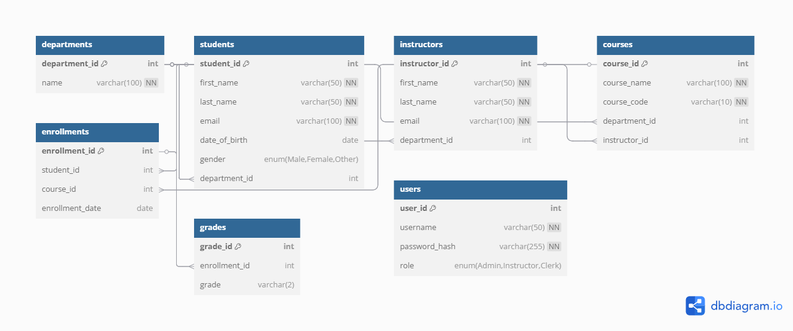

#  Student Records Management System

##  Description

This project implements a relational database system for managing student records. It includes tables for students, instructors, departments, courses, enrollments, and grades.

##  How to Setup

1. Open MySQL Workbench or your preferred SQL interface.
2. Copy and paste the contents of `students_records.sql` into the SQL editor.
3. Run the script to create the database schema.

##  ERD Screenshot

##  Contents

- `students_records.sql`: SQL script to create the database schema
- `README.md`: Project overview and setup instructions

Entities:

Students
Courses
Instructors
Departments
Enrollments (M-M between Students and Courses)
Grades
Users (for admin/staff login)
